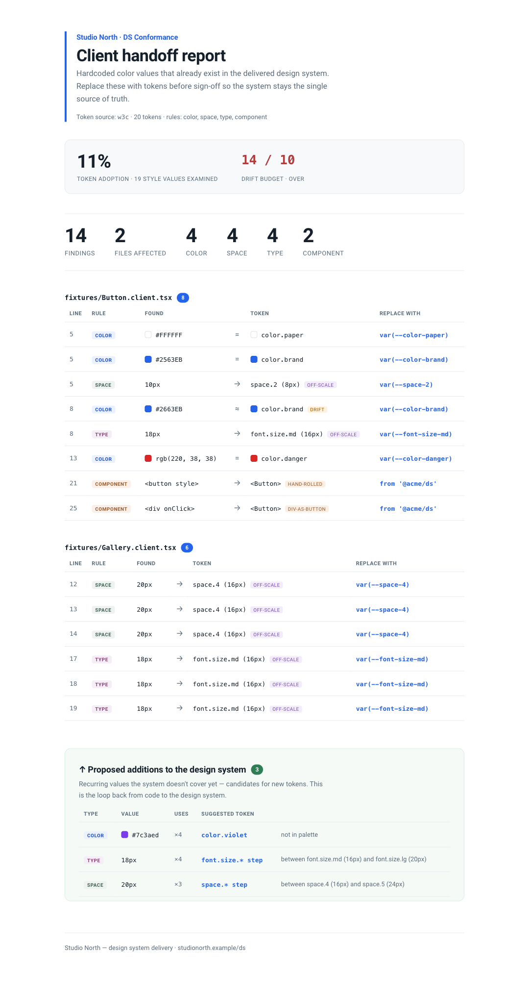
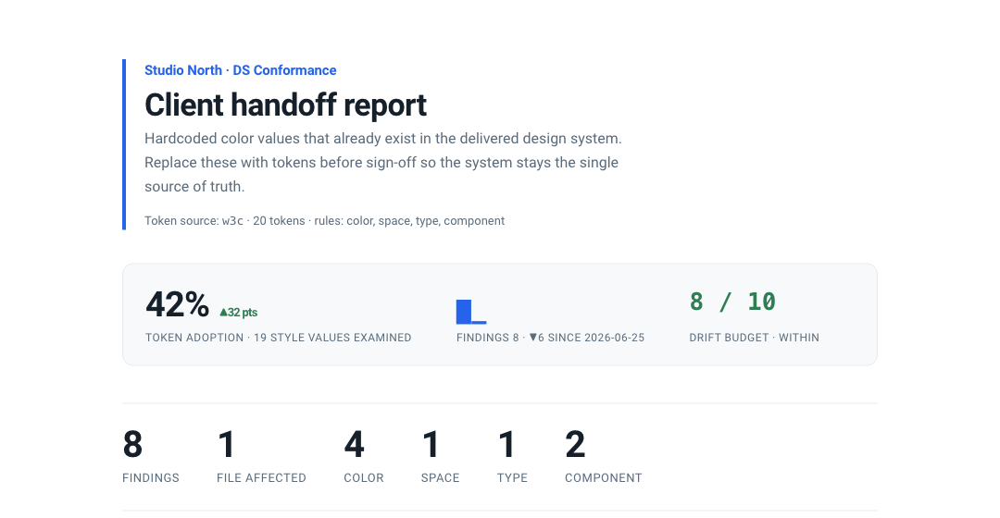

# Wedge

**Design systems rot in code. Wedge stops the rot — and proves it on every pull request.**

  

Wedge is a deterministic **design-system conformance linter**. It catches the gap
every team knows but no tool enforces: the drift between the design system you
publish and the code that's supposed to use it — a hardcoded `#2563EB` where
`color.brand` exists, a `10px` gap off the scale, a `<div onClick>` standing in
for the real Button. It runs in CI, comments on the PR, and tracks adoption over
time so drift is **visible and gateable**.

Brand-free engine, **bring-your-own token source** (Figma Variables, W3C tokens,
CSS variables). White-label by design — the engine is the core, `brand.json` is
the rebrand surface.



## The problem

AI coding tools multiplied how much UI gets written, and most of it quietly
bypasses the design system. The system rots **in the code** — in the gap between
Figma and the repo that design-system platforms publish into but can't see.
Generic "good taste" linting (no purple gradients, no Inter) gets absorbed by
better base models. **Your token graph can't** — it's bespoke to each org. That's
the defensible wedge.

## What it does

- **Four enforcement rules** — color token bypass (with drift tolerance + semantic
  alias resolution), spacing scale, type scale, and hand-rolled components.
- **Proposes new tokens** (code → design) — recurring values the system *doesn't*
  cover become suggested additions. The loop that makes the system better.
- **Drift budget** — adoption % tracked over time, a CI gate that ratchets drift
  down, a sticky PR comment, and a themed HTML/PDF handoff report.
- **AST-precise** — flags real style values only; hexes in URLs, prose, comments,
  and non-style attributes are structurally ignored.



## The moat → the platform

The CLI is the wedge. The defensible business is the **data that accumulates when
you enforce at scale**: per-tenant drift history, cross-tenant adoption baselines,
and a calibration corpus that lowers false-positives. None of it forks with the
code. See **[docs/PLATFORM.md](docs/PLATFORM.md)** for the hosted architecture,
open-core model, white-label/OEM strategy, and build phases — and
**[docs/MARKET.md](docs/MARKET.md)** for sourced market sizing (TAM/SAM/SOM).

## Quickstart

```bash
npm install
node bin/wedge.mjs                 # terminal report
node bin/wedge.mjs --pdf out.pdf   # themed handoff report as PDF
node bin/wedge.mjs --format md     # GitHub-flavored markdown (PR comment body)
node bin/wedge.mjs --comment <pr>  # post/update a sticky PR comment, gate on budget
npm run parity                     # same scan, all 4 token sources -> identical findings
```

## Token sources (bring your own)

| adapter | format |
|---|---|
| `figma-rest` | **live** Figma Variables REST API (`FIGMA_TOKEN`; Enterprise) |
| `w3c` | W3C Design Tokens (`$value` tree) |
| `css-vars` | CSS custom properties (`:root { --color-brand: … }`) |
| `figma-export` | simple `{ name, value }` export |

The same scan over all four produces **identical findings** — the engine never
knows where tokens came from.

## Rules

| rule | flags | suggests |
|---|---|---|
| `literal-instead-of-token` | a hardcoded color that is (or drifts near) a token | the token `var()` |
| `space-off-scale` | a `padding`/`margin`/`gap` off the spacing scale | nearest `space.*` |
| `type-off-scale` | a `font-size` off the type scale | nearest `font.size.*` |
| `handrolled-component` | a raw `<button>` with inline style, or a `<div onClick>` surrogate, when a DS component exists | the DS `<Component>` |
| `propose-token` *(code→design)* | recurring values the system doesn't cover | new tokens to add |

Waivers are **rule-scoped**: `// wedge-disable-line space-off-scale` silences only
that rule on that line.

## CI

Wedge posts a sticky PR comment (updated in place) and exits non-zero when the
drift budget is exceeded:

```yaml
# .github/workflows/wedge.yml
name: wedge
on: pull_request
jobs:
  conformance:
    runs-on: ubuntu-latest
    steps:
      - uses: actions/checkout@v4
      - uses: actions/setup-node@v4
        with: { node-version: 20 }
      - run: npm ci
      - run: node bin/wedge.mjs --comment ${{ github.event.pull_request.number }}
        env: { GH_TOKEN: ${{ secrets.GITHUB_TOKEN }} }
```

## Architecture

```
bin/wedge.mjs        entry: config -> token source -> engine -> reports
src/engine.mjs       brand-free core: rules, token model, adoption stats, proposals
src/scan/            AST + CSS scanners (candidates: color, length, element, tokenref)
src/sources/         TokenSource adapters (Figma / W3C / CSS vars)
src/history.mjs      drift-budget ledger (local JSON → managed store on the platform)
src/report/          text · html · markdown, themed by brand.json
src/pdf.mjs          HTML → PDF via the machine's Chromium (no bundled browser)
src/post/github.mjs  sticky PR-comment poster
brand.json           the rebrand surface  ·  wedge.config.json  per-project config
```

Only runtime dependency: `@babel/parser`. PDF export uses a Chromium-family
browser already on the machine (Chrome/Chromium/Edge/Brave or `$WEDGE_CHROME`).

## Status

**v0.1 — working prototype, all output surfaces shipped** (terminal, PR comment +
CI gate, HTML + PDF handoff). Phase 0 of [the platform roadmap](docs/PLATFORM.md).
Open gaps: `$type:dimension` detection, data-flow tracing for out-of-line style
objects, component adoption in the % metric.

## License

Apache-2.0. Color-parsing in `src/color.mjs` is vendored from
[impeccable](https://github.com/pbakaus/impeccable) (Apache-2.0) — see `NOTICE`.
