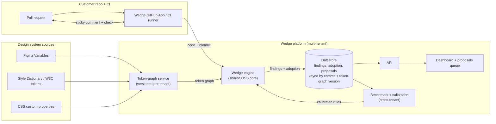
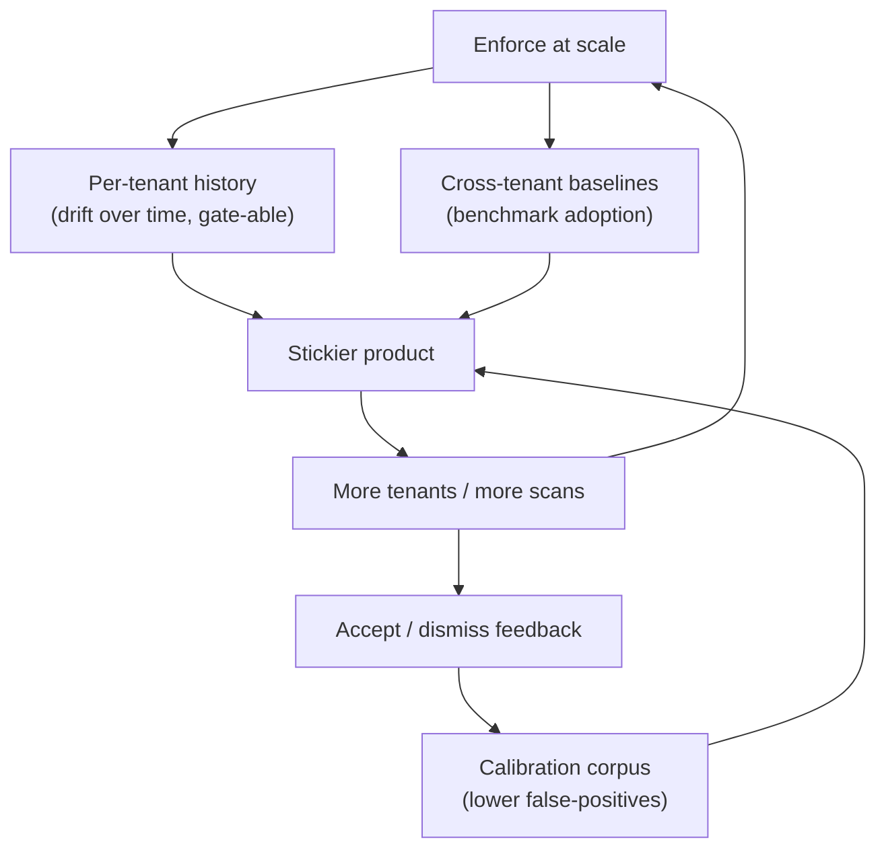

# Wedge — Platform Architecture

> The open-source CLI in this repo is the wedge. This document sketches the
> hosted platform it opens the door to, and why the platform — not the linter —
> is the defensible business.

## 1. Thesis

AI coding tools multiplied how much UI gets written, and most of it quietly
bypasses the design system: a hardcoded `#2563EB` where `color.brand` exists, a
`10px` gap off the scale, a `
` standing in for the Button. Design
systems now rot **in the code**, in the gap between Figma and the repo — the half
that design-system platforms (Supernova, Knapsack, zeroheight) publish into but
cannot see.

Enforcement (design-system → code) is table stakes and forkable. The defensible
asset is the **data that accumulates when you enforce at scale**: per-tenant drift
history, cross-tenant adoption baselines, and a calibration corpus that drives
false-positives down. That data compounds; a rule engine does not.

## 2. Open-core model

| | Open source (this repo, Apache-2.0) | Hosted platform (commercial) |
|---|---|---|
| Engine, rules, token adapters | ✅ free, forkable | same engine, run as a service |
| Terminal / HTML / PDF / PR-comment reports | ✅ | ✅ + dashboards |
| Drift history | local JSON file | **managed, versioned, per-tenant** |
| Adoption trends, proposals queue, budgets | — | ✅ |
| Cross-tenant benchmarks, calibration | — | ✅ (the moat) |
| White-label / OEM | `brand.json` (single) | multi-tenant, partner-branded |

The free CLI is honest and useful on its own — that's the distribution. The
platform sells the thing the CLI structurally can't be: stateful, multi-tenant,
compounding.

## 3. Architecture

Same engine as the OSS CLI — the platform wraps it with state, multi-tenancy, and
the integration surface.

## 4. Components

- **Wedge engine** — the OSS core (rules, token model, AST scan, adoption stats).
  Runs unchanged server-side; the open repo *is* the spec.
- **GitHub App / CI runner** — the integration surface. Checks out the PR, runs
  the engine, posts the sticky comment, sets the check status (budget gate). Also
  a self-hosted runner for code that can't leave the customer's network.
- **Token-graph service** — ingests Figma Variables, Style Dictionary builds, or
  CSS vars; stores **versioned** token graphs per tenant so a finding is always
  attributable to a specific system version. Re-ingests on design-system change.
- **Drift store** — append-only per-tenant time series of findings (by rule),
  proposals, and adoption %, keyed by `(commit, token-graph version)`. This is
  the OSS `.wedge/history.json` promoted to a managed store.
- **API + dashboard** — adoption trend per repo/team, the proposals queue
  (code → design suggestions a DS owner accepts into the system), budget config,
  and the accept/dismiss feedback that feeds calibration.
- **Benchmark + calibration** — cross-tenant adoption baselines ("73%, median for
  studios your size is 68%") and a calibration corpus that lowers false-positives.
- **White-label layer** — `brand.json` at multi-tenant scale: partner-branded
  dashboards, reports, and PR comments.

## 5. The moat — three compounding loops

None of these forks with the code:
1. **History** — a tenant's drift trend and budget are theirs; switching loses it.
2. **Benchmarks** — only the operator with the fleet can produce a cross-tenant baseline.
3. **Calibration** — every accept/dismiss is a label; the corpus a single OSS user can't reproduce.

This is a data network effect, not a feature set.

## 6. White-label / partner model

The buyer is whoever already owns the customer's tokens and brand relationship:

- **Design-system platforms** (Supernova, Knapsack, zeroheight, Specify) — they
  publish the system and have zero code-side enforcement. Wedge is the missing
  half, embedded under their brand. OEM / revenue-share.
- **Consultancies / agencies** — stand up a design system, then have no way to
  keep it from rotting after handoff. Wedge ships as their branded conformance
  product (the handoff report is already in the OSS repo).

## 7. Business model

| Tier | Who | What |
|---|---|---|
| **OSS** (free) | individual devs, OSS projects | CLI, all reports, local history |
| **Team** | product teams | hosted drift store, dashboard, GitHub App, budgets |
| **Platform / OEM** | DS platforms, consultancies | multi-tenant, white-label, benchmarks, revenue-share |

Land with the free CLI (PR comments create pull from within teams), expand to
Team, OEM through platform partners.

## 8. Security posture (partners & investors care)

- **Read-only** code access; the engine never needs write scope.
- **No source egress option** — a self-hosted runner keeps code in the customer's
  network; only metrics (counts, adoption, token names) reach the platform.
- Token-source credentials (e.g. Figma) are per-tenant, encrypted, least-scope.
- SOC 2 path for the Team/Platform tiers; the OSS engine is auditable by anyone.

## 9. Build phases

- **Phase 0 — OSS CLI** ✅ *(this repo)* — engine, 4 rules, code→design proposals,
  4 token sources, local drift budget, terminal/HTML/PDF/PR-comment outputs.
- **Phase 1 — GitHub App + hosted drift store** — managed history, the check + sticky
  comment as a hosted app, budgets per repo.
- **Phase 2 — Dashboard + proposals queue** — adoption trends, the code→design queue
  a DS owner works.
- **Phase 3 — Benchmarks + calibration** — cross-tenant baselines, feedback-driven
  false-positive reduction.
- **Phase 4 — White-label OEM** — partner-branded multi-tenant deployments.

Phase 0 is done and shippable today. Each later phase wraps the same engine in
more state and more surface — the architecture above is the destination, not a
rewrite.
